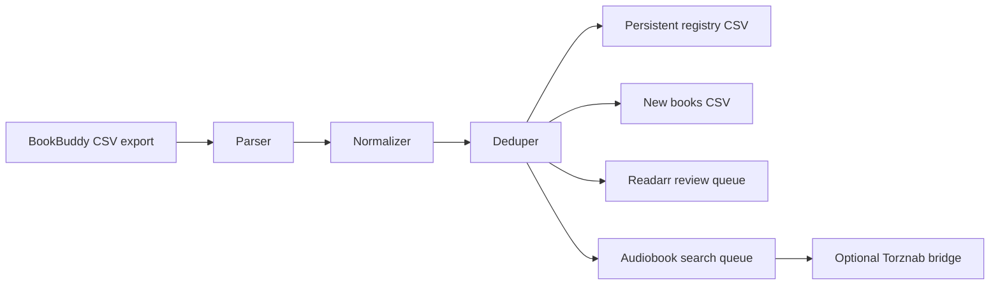

# Architecture

BookBuddARR is a local CLI pipeline.

## Components

- `bookbuddarr.bookbuddy`: reads BookBuddy CSV rows and converts them into normalized records.
- `bookbuddarr.normalize`: text, ISBN, and language normalization.
- `bookbuddarr.registry`: persistent processed-record registry.
- `bookbuddarr.outputs`: generated CSV queues.
- `bookbuddarr.rules`: audiobook-first language and routing rules.
- `bookbuddarr.torznab`: optional Torznab-compatible AudioBookBay bridge.
- `bookbuddarr.cli`: command-line interface.

## Identity Model

Record identity is ISBN-first:

1. If ISBN is present, use `isbn:<normalized ISBN>`.
2. Otherwise, use a stable hash of normalized title, author, and language.

This avoids reprocessing the same scanned edition on later BookBuddy exports while still supporting books without ISBN.

## Integration Boundary

BookBuddARR intentionally does not download or grab releases. It produces review queues for downstream tools such as Readarr and audiobook discovery/search services.

The optional Torznab bridge exposes search results for Prowlarr-style testing. It does not push anything to a download client. Downstream tools must explicitly request a result before the bridge resolves a magnet.

This keeps the first version deterministic, auditable, and safe for public release.
