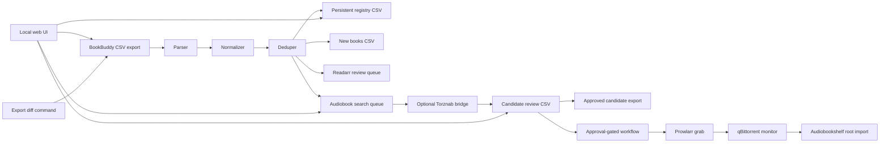

# Architecture

BookBuddARR is a local CLI pipeline.

## Components

- `bookbuddarr.bookbuddy`: reads BookBuddy CSV rows and converts them into normalized records.
- `bookbuddarr.normalize`: text, ISBN, and language normalization.
- `bookbuddarr.registry`: persistent processed-record registry.
- `bookbuddarr.outputs`: generated CSV queues.
- `bookbuddarr.rules`: audiobook-first language and routing rules.
- `bookbuddarr.audiobook_search`: dry-run Torznab search, candidate parsing, language-aware ranking, local review-state output, candidate approve/reject updates, and approved export.
- `bookbuddarr.stack`: redacted stack settings, connection tests, Prowlarr search/grab, qBittorrent monitoring, and filesystem import/verification helpers.
- `bookbuddarr.workflow`: monitored CSV-to-import orchestration with review policy, multipart states, workflow CSV status, and redacted activity logs.
- `bookbuddarr.torznab`: optional Torznab-compatible AudioBookBay bridge.
- `bookbuddarr.web`: local web UI for CSV upload, settings, planning, ingest, candidate review, approve/reject decisions, approved export, and activity display.
- `bookbuddarr.cli`: command-line interface.
- `deploy/service`: repeatable Service compose file, env template, Prowlarr setup helper, and health checks.

## Identity Model

Record identity is ISBN-first:

1. If ISBN is present, use `isbn:<normalized ISBN>`.
2. Otherwise, use a stable hash of normalized title, author, and language.

This avoids reprocessing the same scanned edition on later BookBuddy exports while still supporting books without ISBN.

## Integration Boundary

BookBuddARR remains review-gated at the integration boundary. It produces review queues by default, and the monitored workflow can only hand off releases through configured stack integrations after a candidate is approved or meets the explicit `approved_or_eligible` policy.

The optional Torznab bridge exposes search results for Prowlarr-style testing. It does not push anything to a download client. Downstream tools must explicitly request a result before the bridge resolves a magnet.

`bookbuddarr audiobook-search` queries Torznab RSS in dry-run/review mode and writes candidate rows to local CSV. It stores candidate detail URLs for manual review and does not request grab links.

The monitored workflow prefers Prowlarr aggregate search when Prowlarr URL/API key are configured. Prowlarr candidate rows store `candidate_guid` and `prowlarr_indexer_id` so approved rows can call Prowlarr's release grab endpoint without exposing API keys or raw download URLs in logs.

`bookbuddarr candidates approve`, `reject`, and `export-approved` mutate or export only the local review CSV. They do not call qBittorrent, Readarr, Audiobookshelf, or Torznab grab endpoints. The Audiobookshelf format is a local export-only JSON planning file, not an API mutation.

`bookbuddarr workflow` reuses the same CSV state, then moves through plan, ingest, search, candidate grouping, approval policy, Prowlarr grab, qBittorrent monitoring, import, and verification. It writes operational status to ignored local data. Single numbered parts become `needs_parts`; they are not complete until sibling parts are present and grouped.

`bookbuddarr diff-exports` compares two BookBuddy CSV exports by stable record ID and does not read or write the registry.

The local web UI is a localhost control surface over the same pipeline. It writes uploads, settings, registries, and generated queues under ignored `data/` paths. It masks API-key settings in browser responses.

Service deployment assets keep runtime API keys in env files. The Prowlarr helper is dry-run by default and requires `--apply` for indexer create/update.

This keeps the first version deterministic, auditable, and safe for public release.
